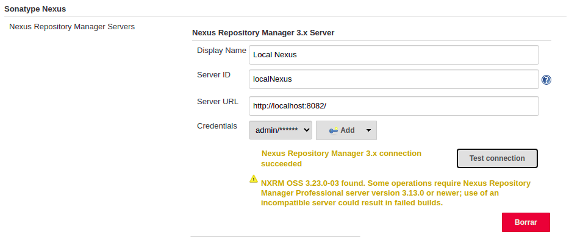

# cicd

Project URL: [https://github.com/chuso/cicd](https://github.com/chuso/cicd)

Both @gortazar and @Maes95 have been added as collaborators.

## Development notes

I have used Jenkins locally directly in my host machine (i.e. it is not running under a container).

```
java -jar jenkins.war --httpPort=8081
```

### GitHub integration

I have integrated Jenkins with GitHub:
1. I created a Personal Acces Token in GitHub (`Settings > Developer Settings > Personal access tokens`) to allow the integration with Jenkins.
2. The token was added in the section `Credentials` of Jenkins.
3. Github was configured in `Manage Jenkins > GitHub > GitHub servers`.
4. Finally, I created a `GitHub Organization` item using my personal credentials and configuring my desired discovery strategy: check Pull Requests head and Pull Request merged with last master (two different jobs). We need to scan the organization to get the list of repositores and check which ones contains the `Jenkinsfile`.

Once this is done, each repository containing a `Jenkinsfile` will contain a webhook pointing to our Jenkins, so that whenever a Pull Request is created or updated, two jobs will be automatically created. When finished, a report will be added to the Pull Request in GitHub:


### Tests suites
I have been reading how to create groups of tests, for example based on paths or on `@Tag()`, so that I can tell Maven from the command line which tests suit it should run. I read about `surefire` and `failsafe`, but it took me so long that, since it's not the goal of the exercise, I ended up using a simpler approach.

To simulate a _unit-test_ verification:

```
mvn -Dtest=es.codeurjc.anuncios.AnuncioTest test
```

To simulate an _integration-test_ verification:

```
mvn -Dtest=es.codeurjc.anuncios.AnunciosControllerTest test
```

The latter creates a docker container and allows to run the test against a real MySQL database.

### Artifacts Repository
A new installation of Nexus has been used with the following repositories: releases repository (`mvn-releases`) and mirror (`mvn-proxy`), gathering both of them in a group  (`mvn-group`).

In addition, Jenkins is now integrated with the local Nexus using the plugin [Nexus Platform](https://plugins.jenkins.io/nexus-jenkins-plugin/). The credentials to connect to the Nexus are stored directly in Jenkins.



This schema -letting Maven publish in Nexus- already provides metadata needed to track which built is associated to a certain artifact. In addition, I'm using `git-commit-id-plugin` when building to provide each build with a file `git.properties` with meta info about the commit.

### Code-Analysis Service
A SonarQube server has been deployed using docker:

```
docker run -d --name sonarqube -p 9000:9000 sonarqube
```

Then, the plugin [SonarQube Scanner](https://plugins.jenkins.io/sonar/) has been installed in Jenkins. The existing SonarQube server has been registered:


And I've been able to send and check reports on it:


## Jenkins Jobs

### On push or Pull Request

There is a default Job, configured in the `Jenkinsfile` file, which is executed when a new commit is pushed or when a Pull Request is created. This Job does the following:

* Downloads and builds the project.
* Runs unit tests.
* Archives tests results.
* Publishes a private SNAPSHOT artifact in Jenkins.

Content of `Jenkinsfile`:
```
pipeline {
    tools {
        maven 'M3'
    }
    agent any
    stages {
        stage('Preparation') {
            steps {
                git 'https://github.com/chuso/cicd.git'
            }
        }
        stage('Package') {
            steps {
                sh 'mvn package -DskipTests'
            }
        }
        stage('Unit Test') {
            steps {
                sh 'mvn -Dtest=es.codeurjc.anuncios.AnuncioTest test'
            }
        }
    }
    post {
        always {
            junit '**/target/surefire-reports/TEST-*.xml'
        }
        success {
            archive 'target/*.jar'
        }
    }
}

```

### Nightly

There is a second Job, configured in `jenkins/nightly`, that is executed every day at 3am according to the server time-zone. This Job is meant to run heavier tasks than those run by the default one, like integration tests or quality analysis. For the sake of simplicity, this project contains just a single integration test which takes around 1 minute, but let's suppose there is a number of integration tests which on average takes half an hour, which would justify having this different job.

The cron pattern used to run this every day at 3am local time is:

```
00 03 * * *
```

This Job does the following:

* Downloads and builds the project.
* Run SonarQube analysis.
* Runs unit tests.
* Runs integration tests.
* Archives tests results.
* Publishes a private NIGHTLY artifact in Jenkins.


Content of `jenkins/nightly`:
```
pipeline {
    tools {
        maven 'M3'
    }
    agent any
    stages {
        stage('Preparation') {
            steps {
                git 'https://github.com/chuso/cicd.git'
            }
        }
        stage('Mark as nightly') {
            steps {
                sh './markNightly.sh'
            }
        }
        stage('Package') {
            steps {
                sh 'mvn package -DskipTests'
            }
        }
        stage('SonarQube analysis') {
            steps {
                withSonarQubeEnv(installationName: "LocalSonar") {
                    sh 'mvn org.sonarsource.scanner.maven:sonar-maven-plugin:3.6.0.1398:sonar'
                }
            }
        }
        stage('Unit Test') {
            steps {
                sh 'mvn -Dtest=es.codeurjc.anuncios.AnuncioTest test'
            }
        }
        stage('Integration Test') {
            steps {
                sh 'mvn -Dtest=es.codeurjc.anuncios.AnunciosControllerTest test'
            }
        }
    }
    post {
        always {
            junit '**/target/surefire-reports/TEST-*.xml'
        }
        success {
            archive 'target/*.jar'
        }
    }
}
```

Content of `markNightly.sh`:

```
#!/bin/bash
sed -i -E "s/<version>(.*)-.*<\/version>/<version>\1-NIGHTLY<\/version>/" pom.xml
```

### Release

Finally, we have `jenkins/release`, which is executed manually. In addition, it contains a string parameter, `$TAG`, which updates the tag in the `pom.xml` file. It does the following:

* Downloads and builds the project.
* Runs unit tests.
* Runs integration tests.
* Archives tests results.
* Publishes a RELEASE artifact in Nexus.


Content of `jenkins/release`:
```
pipeline {
    tools {
        maven 'M3'
    }
    agent any
    stages {
        stage('Preparation') {
            steps {
                git 'https://github.com/chuso/cicd.git'
            }
        }
        stage ('Tag repository') {
            steps {
                sh './changeTag.sh ${TAG}'
            }
        }
        stage('Package') {
            steps {
                sh 'mvn package -DskipTests'
            }
        }
        stage('Unit Test') {
            steps {
                sh 'mvn -Dtest=es.codeurjc.anuncios.AnuncioTest test'
            }
        }
        stage('Integration Test') {
            steps {
                sh 'mvn -Dtest=es.codeurjc.anuncios.AnunciosControllerTest test'
            }
        }
    }
    post {
        always {
            junit '**/target/surefire-reports/TEST-*.xml'
        }
        success {
            script {
                def version = sh(
                    script: "mvn -q -Dexec.executable=\"echo\" -Dexec.args='\${project.version}' --non-recursive org.codehaus.mojo:exec-maven-plugin:1.3.1:exec",
                    returnStdout: true
                ).trim()
                def shortversion = sh(
                    script: "echo '${version}' | sed 's/-.*//'",
                    returnStdout: true
                ).trim()
                nexusPublisher nexusInstanceId: 'localNexus', nexusRepositoryId: 'mvn-releases', packages: [[$class: 'MavenPackage', mavenAssetList: [[classifier: '', extension: '', filePath: "target/cicd-${version}.jar"]], mavenCoordinate: [artifactId: 'cicd', groupId: 'es.urjc.code', packaging: 'jar', version: "${shortversion}"]]]
            }
        }
    }
}
```

Content of `changeTag.sh`:
```
#!/bin/sh
sed -i "s/<version>.*-.*<\/version>/<version>$1<\/version>/" pom.xml
```

## Workflow

This project has taken too long to me, so since I ran out of time, I didn't have the chance to figure out on which workflow it would rely (namely, gitflow, TBD, or any specific variation).
