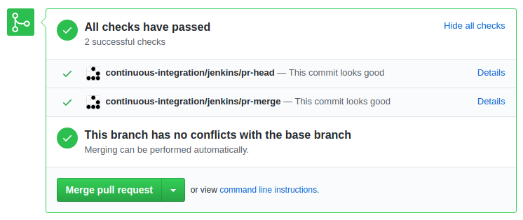

# cicd

## Development instructions

I have used Jenkins locally directly in my host machine (i.e. it is not running under a container).

```
java -jar jenkins.war --httpPort=8081
```

### GitHub integration

I have integrated Jenkins with GitHub:
1. I created a Personal Acces Token in GitHub (`Settings > Developer Settings > Personal access tokens`) to allow the integration with Jenkins.
2. The token was added in the section `Credentials` of Jenkins.
3. Github was configured in `Manage Jenkins > GitHub > GitHub servers`.
4. Finally, I created a `GitHub Organization` item using my personal credentials and configuring my desired discovery strategy: check Pull Requests head and Pull Request merged with last master (two different jobs). We need to scan the organization to get the list of repositores and check which ones contains the `Jenkinsfile`.

Once this is done, each repository containing a `Jenkinsfile` will contain a webhook pointing to our Jenkins, so that whenever a Pull Request is created or updated, two jobs will be automatically created. When finished, a report will be added to the Pull Request in GitHub:



### Tests suites
I have been reading how to groups of tests, for example based on paths or on `@Tag()`, so that I can tell Maven which suit to run from the command line. I read about `surefire` and `failsafe`, but it took me so long that, since it's not the goal of the exercises, I ended up using a simpler approach.

To simulate a _unit-test_ verification:

```
mvn -Dtest=es.codeurjc.anuncios.AnuncioTest test
```

To simulate an _integration-test_ verification:

```
mvn -Dtest=es.codeurjc.anuncios.AnunciosControllerTest test
```

### Artifacts Repository
A new installation of Nexus has been used, following the repositories structure suggested in last class: snapshots repository (`mvn-snapshots`), releases repository (`mvn-releases`) and mirror (`mvn-proxy`), gathering all of them in a group  (`mvn-group`).

In addition, Jenkins is now integrated with the local Nexus using the plugin [Nexus Platform](https://plugins.jenkins.io/nexus-jenkins-plugin/). The credentials to connect to the Nexus are stored directly in Jenkins.

TODO: provide screenshot of the `Sonatype Nexus` section in the settings http://79d0ff5ab2f7.ngrok.io/configure.

This schema -letting Maven publish in Nexus- already provides metadata needed to track which built is associated to a certain artifact. In addition, `git-commit-id-plugin` when building to provide each build with a file `git.properties` with meta info about the commit.

## Jenkins Jobs

### On push or Pull Request

There is a default Job, configured in the `Jenkinsfile` file, which is executed when a new commit is pushed or when a Pull Request is created. This Job does the following:

* Downloads and builds the project.
* Runs unit tests.
* Archives tests results.
* Publish a SNAPSHOT artifact in our private repository.

### Nightly

There is a second Job, configured in `jenkins/nightly`, that is executed everyday at 3:00am according to the server time-zone. This Job is meant to run heavier tasks than those run by the default one, like integration tests or quality analysis. For the sake of simplicity, this project contains just a single integration test which takes around 1 minute, but let's supose there is a number of integration tests which on average takes half an hour, which would justify having this different job.
